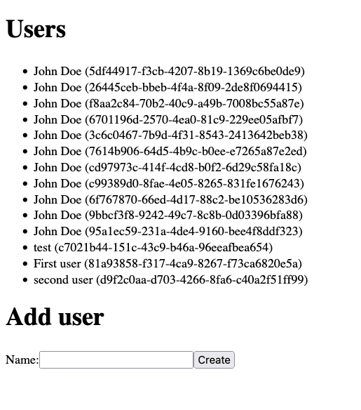

# typed-prisma-package

This repository is an example on how to manage your prisma setup from a central place and export a package which wraps the "normal" Prisma but include your specific typings. It is useful for e.g. a microservice setup in which every service can import the package and you can manage/publish the prisma package from a dedicated place/repository.

## Structure

- The `prisma/` directory contains everything prisma related (e.g. schema, migrations) and also the code to bundle the typed prisma package in your own
- The `next/` directory is a basic webapp to showcase how it works on the other side when you use the package, in your case this does NOT need to be in the same repository!
- The `.github/workflows/` directory contains an example GitHub Actions file on how to publish the package to a npm registry

## Manual setup

Start the database in background via docker

```bash
$ docker-compose up -d postgres
```

Switch to the prisma directory

```bash
$ cd prisma
```

Install dependencies

```bash
$ npm i
```

Create the npm package, this step will also run the `prepare` script which generates the typings via `prisma generate` and compiles the `index.ts`

```bash
$ npm pack
```

The above steps are the ones necessary to create the package, from here you could e.g. run `npm publish` or manually use the generated `.tgz` file which we're going to do now for the example.

---

But first we need to make sure all migrations are deployed against the local database

```bash
prisma migrate deploy
```

Now we can move the generated package over in the example Next.js app

```bash
mv marcmogdanz-typed-prisma-package-1.0.0.tgz ../next
```

And switch over to the directory

```bash
cd ../next
```

Now we can simply install the package

```bash
npm i marcmogdanz-typed-prisma-package-1.0.0.tgz
```

And run the Next.js app

```bash
npm run dev
```

Now you can head to [http://localhost:3000](http://localhost:3000), create an example user and see all existing users. Check out the routes in the `next/pages/api` directory to see the typed prisma package in action.



# CI via GitHub Actions

In the `.github/workflows/database.yml` file you can find an example on how to pack and publish this to a (private) npm registry, in this case GitHub's.
The package is now available [here](https://github.com/MarcMogdanz/typed-prisma-package/packages/1114330) and the easiest way to install it another project is to create a `.npmrc` in the repository where you want to use the package (e.g. my example Next.js app) and override the registry key for your scope (in my case `@marcmogdanz`) like below:

```
@marcmogdanz:registry = https://npm.pkg.github.com/marcmogdanz

_authToken = "ghp_TOKEN_WITH_PACKAGE_ACCESS"
always-auth = true
```
